dashboard app User Guide
=======================================

:link_to_translation:`zh_CN:[中文]`

1 Download
------------------

Scan the QR code to download and install.

.. figure:: ../../../_static/dashboard_app/download_qr_code.png
   :alt: downlaod_qr_code
   :width: 30%
   
   Download QR Code

2 Introduction
------------------
This app allows the development board to play navigation voice and display navigation images. According to different image transmission methods, it is divided into Bluetooth image transmission and WiFi image transmission.

3. Development Board Introduction
-----------------------

The following development board is used as an example.

- Reset button: Reset the development board
- K1 button: Clear network configuration information and reset the development board

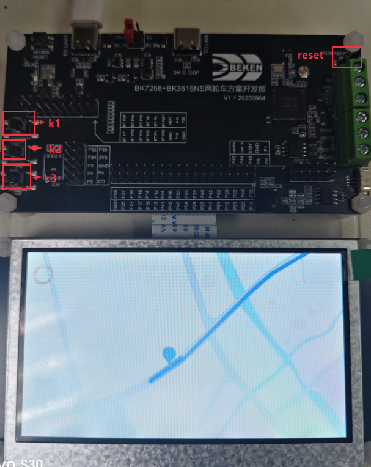

   Example Development Board

4. WiFi Image Transmission Usage Steps
-----------------------

Images are transmitted via WiFi, and voice is transmitted via classic Bluetooth.

4.1 Reset Development Board
,,,,,,,,,,,,,,,,,,,,,,,,,,,,,,

Press the K1 button to reset the development board.

4.2 Configuration
,,,,,,,,,,,,,,,,,,,,,,,,,,,,,,

Select configuration as needed.

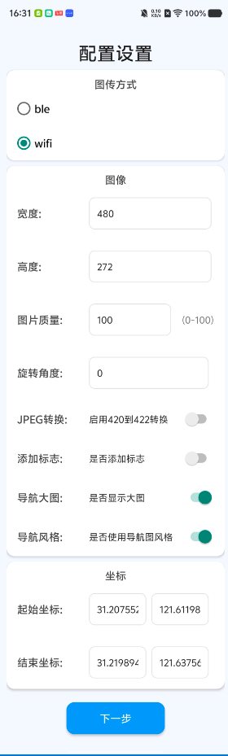

   Settings

4.3 Network Configuration
,,,,,,,,,,,,,,,,,,,,,,,,,,,,,,

Use BLE for network configuration.

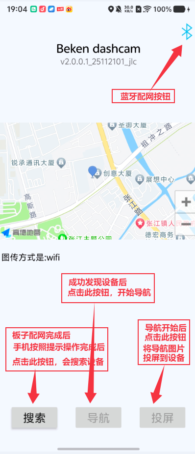

   WiFi Interface Function Introduction

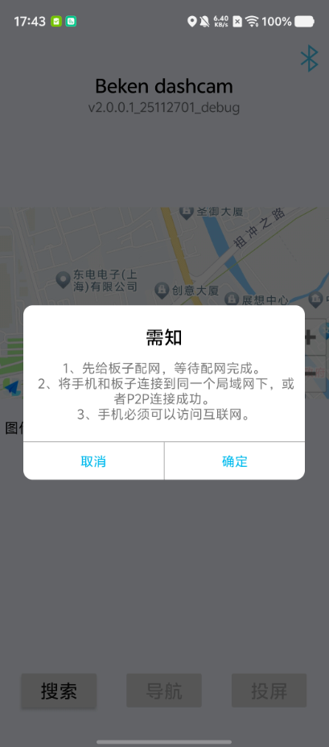

   Network Configuration Tips

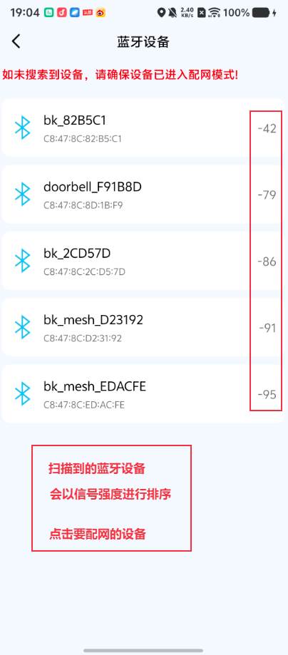

   Bluetooth Scan Results

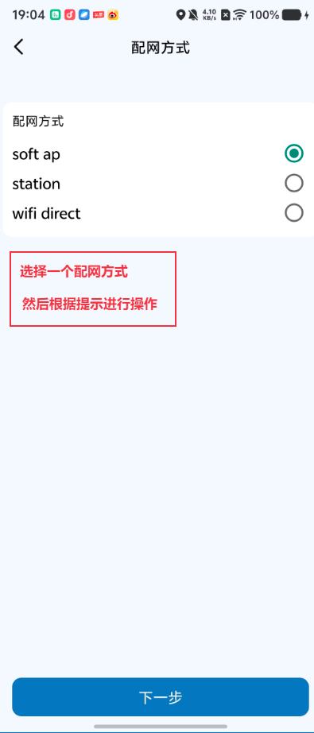

   Select Network Configuration Type

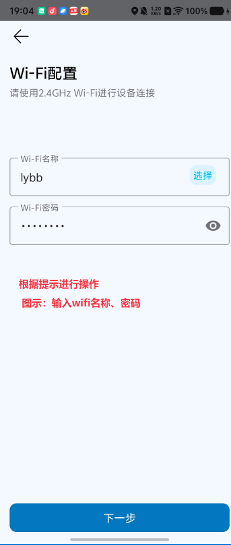

   Enter Network Configuration Information

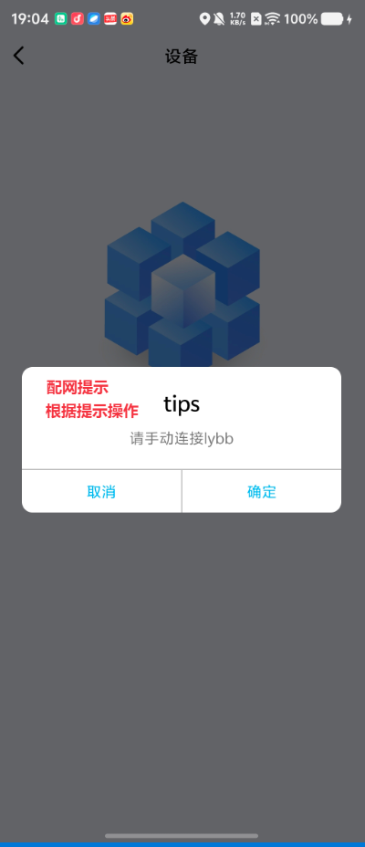

   Network Configuration Successful

4.4 Voice Configuration
,,,,,,,,,,,,,,,,,,,,,,,,,,,,,,

Navigation voice is transmitted via classic Bluetooth.

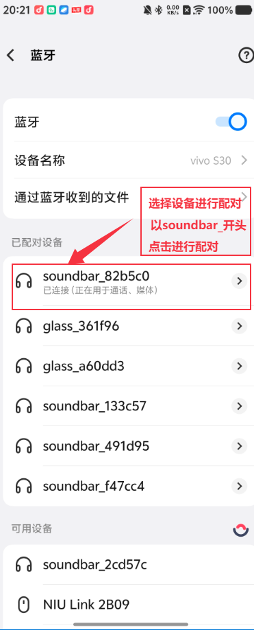

   Bluetooth Pairing

4.5 Discover Device
,,,,,,,,,,,,,,,,,,,,,,,,,,,,,,

Click search, select type, and start searching for devices.

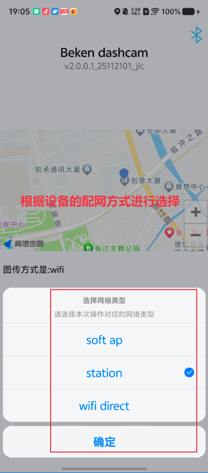

   Discover Device

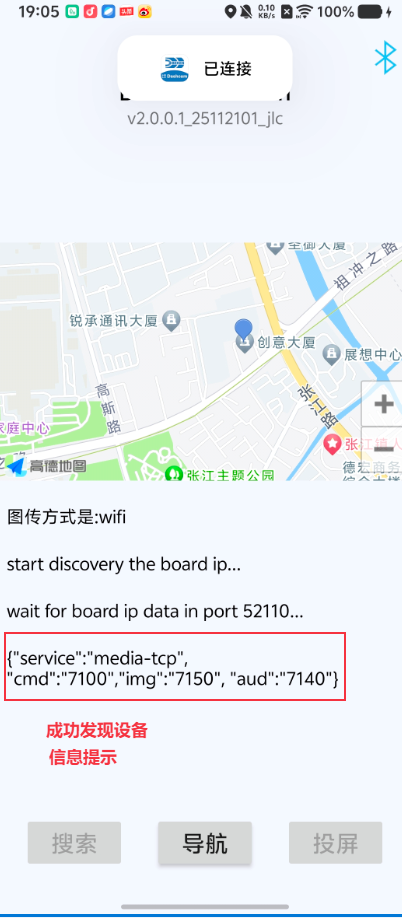

   Device Discovery Successful

4.6 Navigation and Image Transmission
,,,,,,,,,,,,,,,,,,,,,,,,,,,,,,

Click the navigation function button to start navigation. After navigation starts, you can click the screen mirroring button to start screen mirroring.

5. Bluetooth Image Transmission Usage Steps
-----------------------

Images are transmitted via BLE, and voice is transmitted via classic Bluetooth.

5.1 Reset Development Board
,,,,,,,,,,,,,,,,,,,,,,,,,,,,,,

Press the K1 button to reset the development board.

5.2 Settings
,,,,,,,,,,,,,,,,,,,,,,,,,,,,,,
Select configuration as needed.

   Settings

5.3 Select Image Transmission Device
,,,,,,,,,,,,,,,,,,,,,,,,,,,,,,

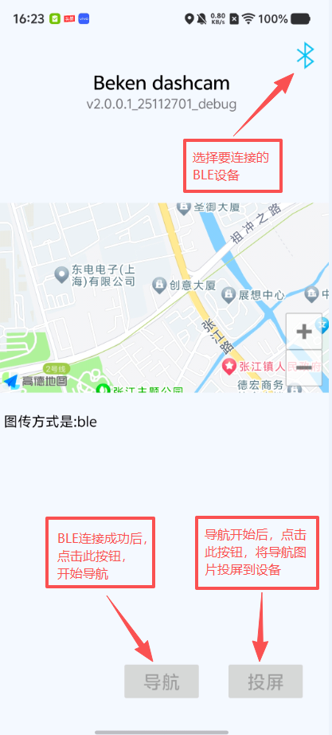

   Bluetooth Image Transmission Interface Function Introduction

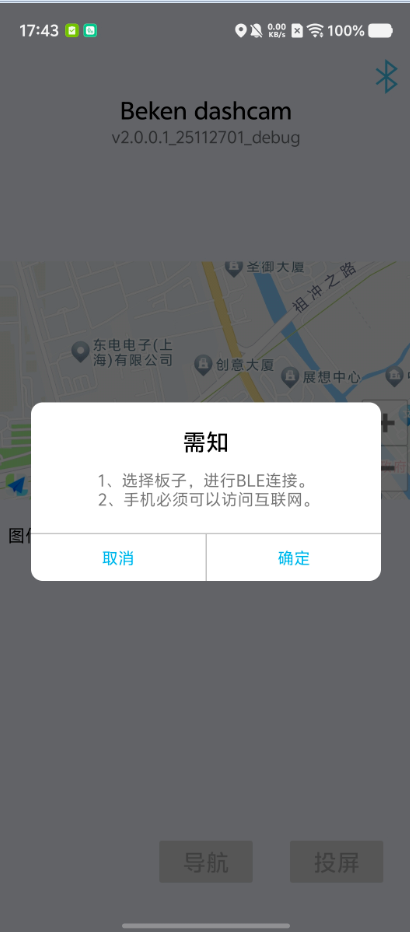

   Bluetooth Tips

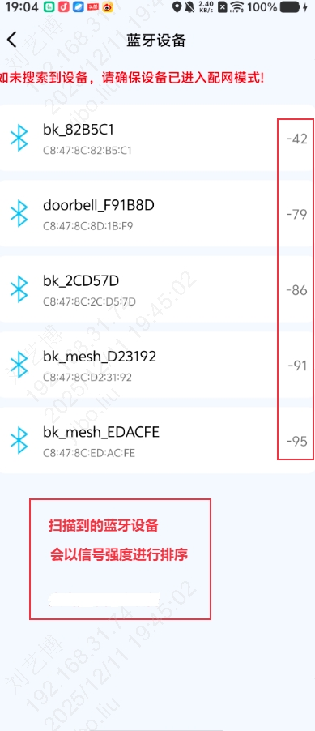

   Bluetooth Scan Results

5.4 Voice Configuration
,,,,,,,,,,,,,,,,,,,,,,,,,,,,,,

Navigation voice is transmitted via classic Bluetooth.

   Bluetooth Pairing

5.5 Navigation and Image Transmission
,,,,,,,,,,,,,,,,,,,,,,,,,,,,,,

Click the navigation function button to start navigation. After navigation starts, you can click the screen mirroring button to start screen mirroring.

