dashboard app使用指南
=======================================

:link_to_translation:`en:[English]`

1 下载
------------------

扫描二维码，下载安装。

   Android App

   iOS App

2 简介
------------------
通过此app,让开发板播放导航语音，显示导航图片。根据图传方式的不同，分为蓝牙图传和wifi图传。

3. 开发板介绍
-----------------------

以如下开发板举例。

- reset 按键：复位开发板
- 长按下键: 清除配网信息并复位开发板

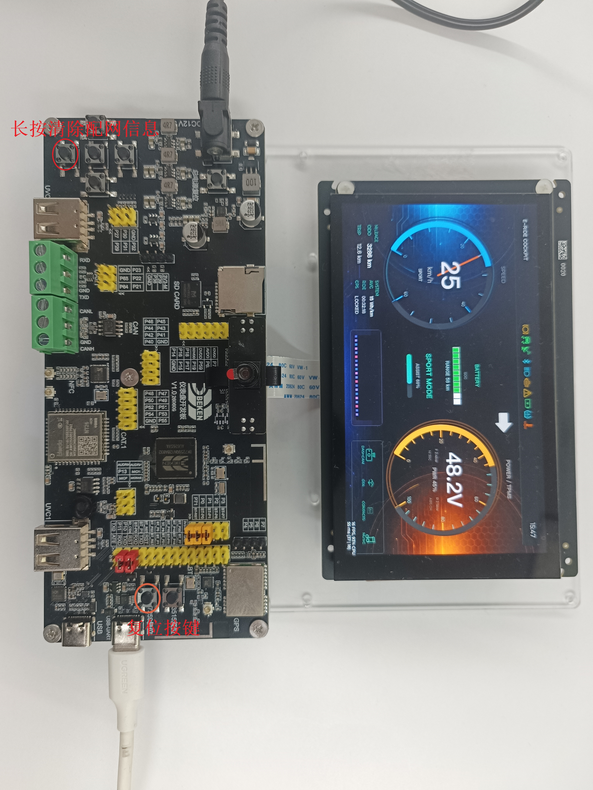

   示例开发板

4. WIFI图传使用步骤
-----------------------

通过wifi传输图片,通过经典蓝牙传输语音。

4.1 重置开发板
,,,,,,,,,,,,,,,,,,,,,,,,,,,,,,

长按下键，重置开发板。

4.2 配置
,,,,,,,,,,,,,,,,,,,,,,,,,,,,,,

根据需要选择配置，注意宽度和高度需要配成与开发板屏幕尺寸一致。

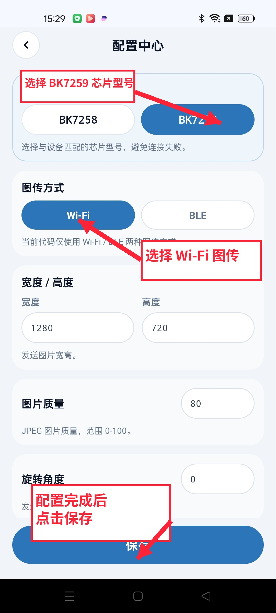

   配置中心

4.3 配网
,,,,,,,,,,,,,,,,,,,,,,,,,,,,,,

使用BLE进行配网。

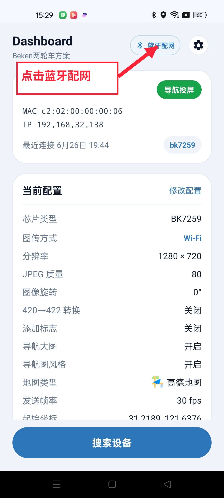

   首页与当前配置

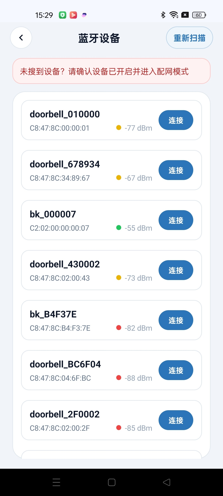

   蓝牙设备扫描结果

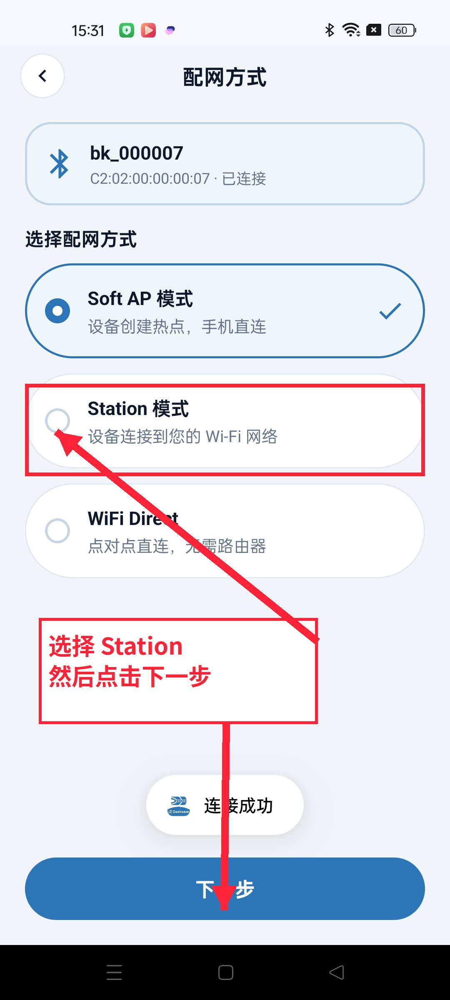

   选择配网方式

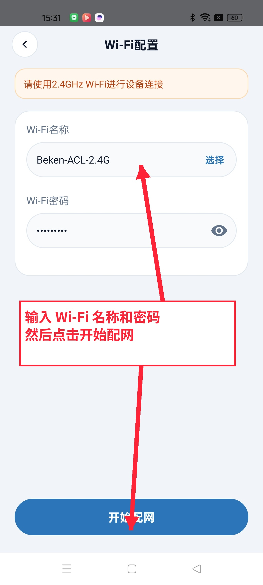

   输入 Wi-Fi 配置信息

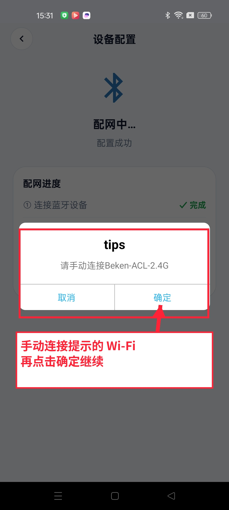

   配网进度提示

4.4 语音配置
,,,,,,,,,,,,,,,,,,,,,,,,,,,,,,

导航语音通过经典蓝牙进行传输。

.. figure:: ../../../_static/dashboard_app/bt_pair.png
   :alt: bt_pair
   :width: 30%

   蓝牙配对

4.5 发现设备
,,,,,,,,,,,,,,,,,,,,,,,,,,,,,,

点击搜索，选择类型，开始搜索设备。

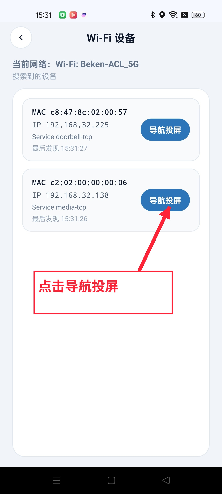

   Wi-Fi 设备列表

4.6 导航与图传
,,,,,,,,,,,,,,,,,,,,,,,,,,,,,,

点击导航功能按钮，开始导航。导航开始后，可以点击投屏按钮，开始投屏。

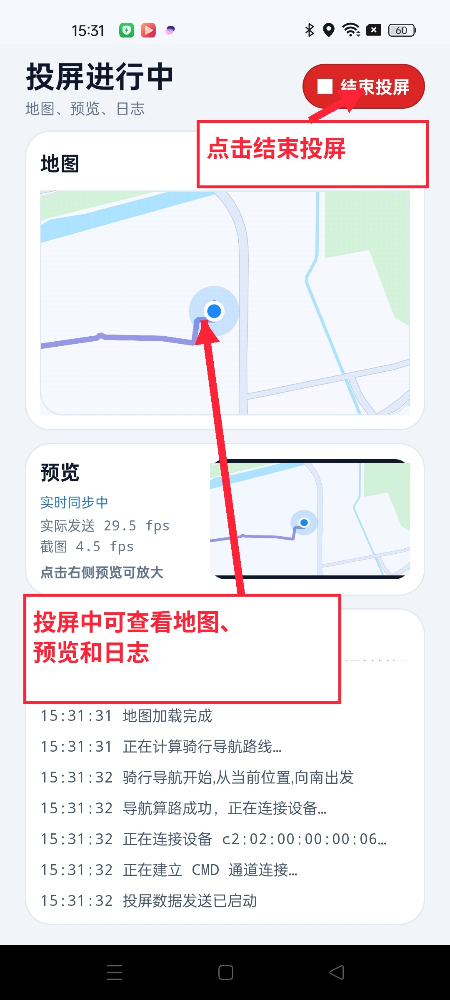

   投屏进行中

5. 蓝牙图传使用步骤
-----------------------

通过BLE传输图片,通过经典蓝牙传输语音。

5.1 重置开发板
,,,,,,,,,,,,,,,,,,,,,,,,,,,,,,

长按下键，重置开发板。

5.2 设置
,,,,,,,,,,,,,,,,,,,,,,,,,,,,,,
根据需要选择配置。

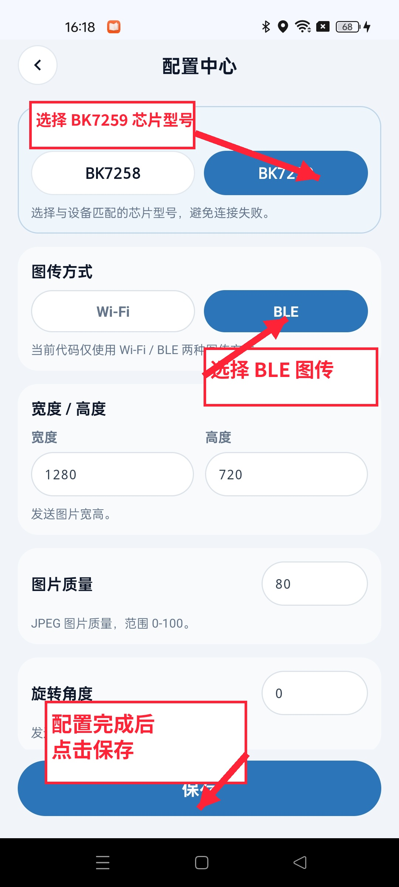

   BLE 图传配置

5.3 选择图传设备
,,,,,,,,,,,,,,,,,,,,,,,,,,,,,,

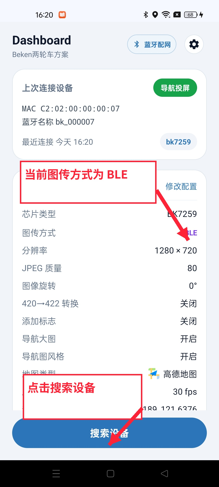

   BLE 图传首页与当前配置

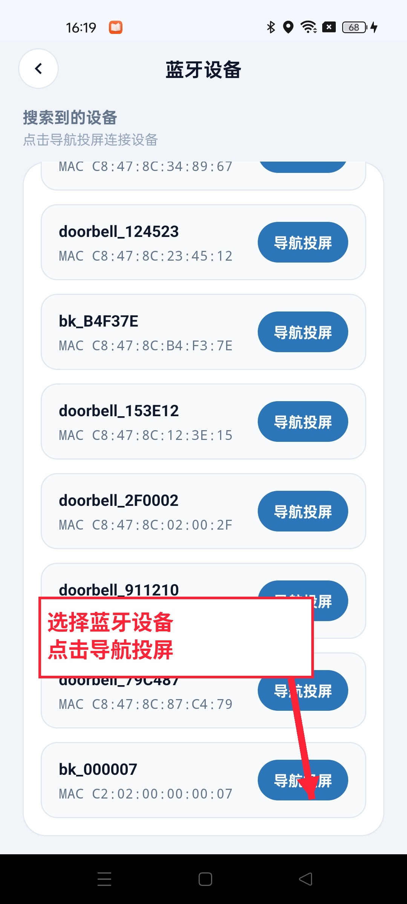

   蓝牙设备列表

5.4 语音配置
,,,,,,,,,,,,,,,,,,,,,,,,,,,,,,

导航语音通过经典蓝牙进行传输。

.. figure:: ../../../_static/dashboard_app/bt_pair.png
   :alt: bt_pair
   :width: 30%

   蓝牙配对

5.5 导航与图传
,,,,,,,,,,,,,,,,,,,,,,,,,,,,,,

点击导航功能按钮，开始导航。导航开始后，可以点击投屏按钮，开始投屏。

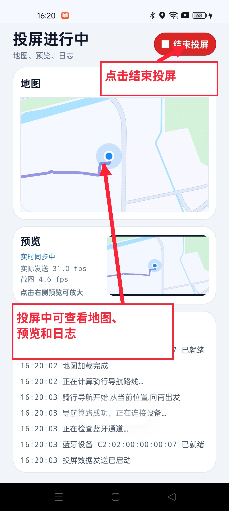

   BLE 投屏进行中